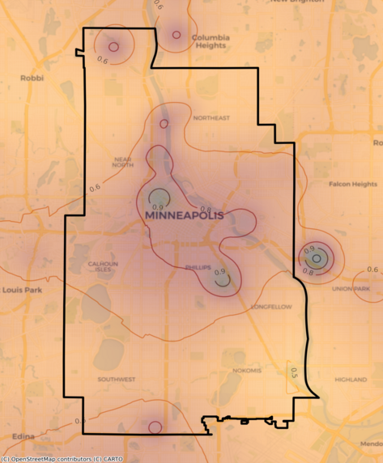

<h1 class="project-name" style = "color:white">{{ page.title | default: site.title | default: site.github.repository_name }}</h1>

 <!--width=500-->

<!--<a href="https://redcap.ahc.umn.edu/redcap/surveys/?s=NH7JNNNR8LNCT8CN">--><button> Sign Up Here   (SpikeAlerts is down)</button></a> &nbsp;
 <a href="https://app.smartsheet.com/b/form/45e0e547ab9046d3aecbdfd9f73498a7"><button> Report to Minneapolis </button></a>&nbsp;
  <a href="https://netweb.pca.state.mn.us/private/CitizenComplaints.aspx?RequestedPage=ComplaintForm&task=ComplaintEntryTask"><button> Report to MPCA </button></a>

<h2 class="project-tagline" style = "color:white">{{ page.description }} </h2>

 <a href="./index" style = "color: GreenYellow">Home</a> ~ <a href="./pages/FAQs" style = "color: GreenYellow">FAQs</a> ~ <a href="./pages/about" style = "color: GreenYellow">About</a> ~ <a href="./pages/resources" style = "color: GreenYellow">Resources</a> ~ <a href="./pages/contact" style = "color: GreenYellow">Contact</a> 

  Website maintained by <a href="{{ site.github.owner_url }}" style = "color:white">{{ site.github.owner_name }}</a> and generated by <a href="https://pages.github.com" style = "color:white">GitHub Pages</a>.
