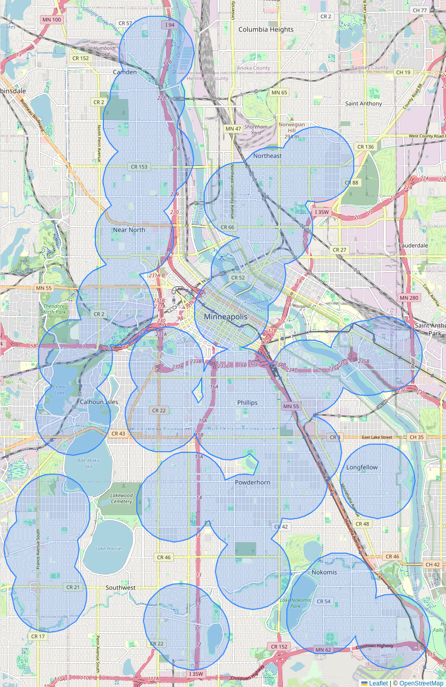

<!-- For Collapible cell formatting - https://developer.mozilla.org/en-US/docs/Web/HTML/Element/details -->

<h1> <small><small><small><i>(Click to Expand an answer)</i></small></small></small></h1>

<h1><b>Definitions</b></h1>

<h2>What is a SpikeAlert?</h2>

A "SpikeAlert" is a warning that air quality <b>may</b> be harmful in your area. 
This is tough to define, and we hope to get a better idea with your help!

  

Currently, we are sending out alerts when a <a href="https://www2.purpleair.com/">PurpleAir</a> sensor reads 10-minute average Particulate Matter 2.5 (PM2.5) levels over the <a href="https://www.epa.gov/pm-pollution/national-ambient-air-quality-standards-naaqs-pm" target="_blank">24-hour National Ambient Air Quality Standard</a> (NAAQS) within 1 kilometer of your designated location of interest.

<!-- Example Question -->

<h2>What is PM2.5?</h2>

Particulate matter 2.5 (PM2.5) is a major <a href="https://www.who.int/teams/environment-climate-change-and-health/air-quality-and-health/health-impacts/types-of-pollutants" target="_blank">air pollutant</a> of concern.

  

PM2.5 are generic particles of 2.5 micrometers in diameter (or smaller) that are created during the combustion processes of cars, energy production, manufacturing, and trash incineration as well as forest fires, backyard bonfires, and small gas engines! 

  

The American Heart Association (AHA) has established a causal link between these particles and heart and lung disease (<a href="https://hpforhc.org/wp-content/uploads/2021/11/HPHC_factsheet_AirPollution.pdf">Source</a>).

<h1><b>Functionality</b></h1>

<!-- Example Question -->

<h2>Why haven't I received an alert, yet?</h2>

There is a chance that there are no air monitors in your area!

  

If you or someone you know would be interested in hosting a sensor here is a <a href="https://www.minneapolismn.gov/government/programs-initiatives/environmental-programs/air-quality/host-air-sensor/" target="_blank">link</a> to request one from the City.

  

In the meantime, we'll work on letting you know about city-wide air quality events.

  

<h2>Current SpikeAlerts Coverage</h2>

<h1><b>Privacy</b></h1>

<!-- Example Question -->

<h2>What happens to my report?</h2>

You can opt-in to report to a community organization, Minneapolis Health Department (MHD), the Minnesota Pollution Control Agency (MPCA), and/or submit your comment anonymously as a community scientist for air quality research!

   

We will not share your report information with any org or government agency without your consent.

  

Reports are stored in a <a href="https://www.ncbi.nlm.nih.gov/pmc/articles/PMC5764586/" target="_blank">REDCap</a> database hosted by the University of Minnesota.

<!-- Example Question -->

<h2>Are reports anonymous?</h2>

The app's database intentionally "unrelates" user information when archiving reports. Time of event and nearby sensors are recorded but not the user's location/phone number.

<h2>Phone Numbers?</h2>

Phone numbers are stored in a <a href="https://www.ncbi.nlm.nih.gov/pmc/articles/PMC5764586/" target="_blank">REDCap</a> database hosted by the University of Minnesota. 

  

Our current SMS service is <a href="https://www.twilio.com/en-us/legal/privacy#data-about-our-customers-end-users" target="_blank">Twilio</a> which keeps a log of messages and phone numbers. We plan to delete these on a rolling basis.

<h2>How to delete my information?</h2>

At anytime you can reply to our phone number with a text saying "STOP", and we will delete your phone number and all messaging information from our SMS service (<a href="https://en.wikipedia.org/wiki/Twilio" target="_blank">Twilio</a>).

  

To resubscribe, reply to the same number with a text saying "START" and submit a new sign up form.

